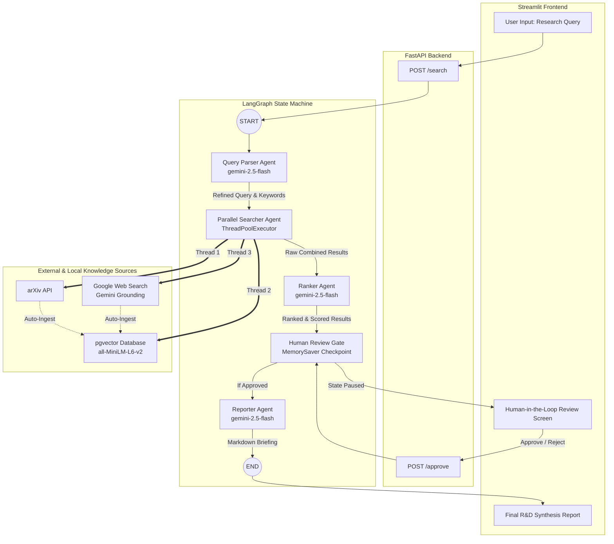

# 🚀 Innovation Scout R&D Engine

**Innovation Scout** is an advanced, multi-agent knowledge retrieval, verification, and synthesis platform designed for enterprise technology scouts, R&D directors, and scientific researchers. Powered by **LangGraph** state machines and **Google Gemini (2.5 Flash)**, the engine performs 3-way parallel agent scans across academic repositories, local vector stores, and live web intelligence, incorporating a **Human-in-the-Loop (HITL)** approval gate before compiling comprehensive research briefings.

---

## ✨ Key Features

- **Multi-Agent LangGraph Orchestration**: A structured state graph workflow that breaks down complex research queries, searches parallel sources, ranks findings, pauses for human evaluation, and generates publication-grade summaries.
- **3-Way Parallel Agent Scans**: Concurrently queries **arXiv** (scientific literature), **pgvector** (local historical knowledge base), and **Google Web Grounding** (live market/tech intelligence) via multi-threading.
- **AI-Powered Ranking & Credibility Scoring**: Evaluates discovered assets on strict 0.0 to 1.0 scales for relevance and scientific/market credibility, providing precise engineering rationales for every score.
- **Human-in-the-Loop (HITL) Gate**: Seamlessly pauses the LangGraph execution thread, allowing researchers to inspect, verify, approve, or reject gathered intelligence before report compilation.
- **Automated Vector DB Ingestion**: Automatically embeds new live web articles and arXiv papers using `sentence-transformers` (`all-MiniLM-L6-v2`) and persists them into a PostgreSQL `pgvector` database for future similarity matching.
- **Modern Full-Stack Interface**: A decoupled architecture featuring a robust **FastAPI** asynchronous backend and an intuitive, wide-layout **Streamlit** dashboard.

---

## System Architecture & Agent Workflow



*(Note: A high-resolution flowchart is also automatically generated and saved locally as `graph_flowchart.png` when testing the pipeline).*

---

## Project Structure

```text
innovation-scout/
├── agents/
│   ├── query_parser.py     # LLM node transforming raw queries into structured keywords
│   ├── searcher.py         # Multi-threaded parallel searcher across arXiv, DB, and Web
│   ├── ranker.py           # AI evaluator scoring relevance & credibility with rationales
│   └── reporter.py         # Final synthesis node generating markdown briefing reports
├── graph/
│   ├── pipeline.py         # LangGraph state graph assembly, compilation, and checkpointer
│   └── state.py            # TypedDict defining the shared state across all agent nodes
├── hitl/
│   └── human_review.py     # Human-in-the-loop checkpoint pause node
├── tools/
│   ├── arxiv_tool.py       # Wrapper for querying the arXiv academic paper API
│   ├── init_db.py          # Script to initialize PostgreSQL tables and pgvector extension
│   ├── vector_store.py     # sentence-transformers embedding & pgvector cosine similarity
│   └── web_search_tool.py  # Gemini-powered live web search with Google Search grounding
├── app.py                  # Streamlit interactive frontend dashboard
├── main.py                 # FastAPI backend server managing sessions and graph execution
├── docker-compose.yml      # Docker Compose configuration for pgvector database container
├── requirements.txt        # Project Python dependencies
└── README.md               # Project documentation
```

---

## Prerequisites & Installation

### 1. Prerequisites
- **Python 3.10+**
- **Docker & Docker Compose** (for running the PostgreSQL `pgvector` container)
- **Google Gemini API Key** (with access to `gemini-2.5-flash` and Google Search grounding)

### 2. Clone and Setup Virtual Environment
```bash
git clone https://github.com/your-username/innovation-scout.git
cd innovation-scout

# Create and activate virtual environment
python -m venv venv
# On Windows:
venv\Scripts\activate
# On Linux/macOS:
source venv/bin/activate

# Install dependencies
pip install -r requirements.txt
```

### 3. Environment Configuration
Create a `.env` file in the root directory and add your Google Gemini API key:

```env
GEMINI_API_KEY=your_actual_gemini_api_key_here
```

---

## Running the Application

### Step 1: Start the Vector Database
Launch the PostgreSQL `pgvector` container using Docker Compose:
```bash
docker-compose up -d
```
*(Verify the container is healthy and running on port `5432`).*

### Step 2: Initialize the Database Schema
Run the database initialization script to create the necessary tables and enable the `vector` extension:
```bash
python tools/init_db.py
```
*Expected Output: `Database initialized successfully`*

### Step 3: Start the FastAPI Backend Server
Launch the asynchronous backend API server:
```bash
python main.py
```
*(The FastAPI server will start on `http://127.0.0.1:8000` with live reloading enabled).*

### Step 4: Start the Streamlit Frontend Dashboard
Open a new terminal, activate your virtual environment, and launch the Streamlit app:
```bash
streamlit run app.py
```
*(The Streamlit dashboard will automatically open in your default browser at `http://localhost:8501`).*

---

## Usage Walkthrough

1. **Enter Research Query**: On the main Streamlit screen, input your high-level research or business problem (e.g., *"Eco-friendly bio-plastics for protective phone cases"*). Click **Search**.
2. **Parallel Execution**: The backend initiates a LangGraph session, parsing your query into targeted keywords and simultaneously scanning arXiv, the local vector database, and the live web.
3. **Evaluate Results (HITL Gate)**: The graph pauses execution and presents the top-ranked scientific and market discoveries. Review the assigned **Relevance** and **Credibility** scores, progress bars, and AI reasoning.
4. **Approve or Reject**:
   - **Approve & Compile Briefing Report**: Resumes the LangGraph state machine to synthesize the top assets into a polished markdown briefing report.
   - **Reject & Clear Session**: Halts the workflow and resets the session for a new query.
5. **Review Final Briefing**: Explore the generated report complete with verified high-value assets, credibility metrics, and source links.

---

## API Reference

### `POST /search`
Initiates a new LangGraph research session.
- **Payload**: `{"query": "your research topic"}`
- **Response**: Returns `session_id`, status, expanded keywords, and ranked research results.

### `POST /approve`
Submits human review decision to resume or terminate the LangGraph thread.
- **Payload**: `{"session_id": "uuid", "approve": true}`
- **Response**: Returns the final compiled markdown briefing report (`final_report`).

---

## Standalone Module Testing

You can independently verify individual components and agent nodes using their built-in test blocks:

```bash
# Test Query Parser Agent
python agents/query_parser.py

# Test 3-Way Parallel Searcher
python agents/searcher.py

# Test Ranker Agent
python agents/ranker.py

# Test Integrated LangGraph Flow & Generate Flowchart PNG
python graph/pipeline.py
```

---

## License

This project is licensed under the MIT License. See the `LICENSE` file for more details.
